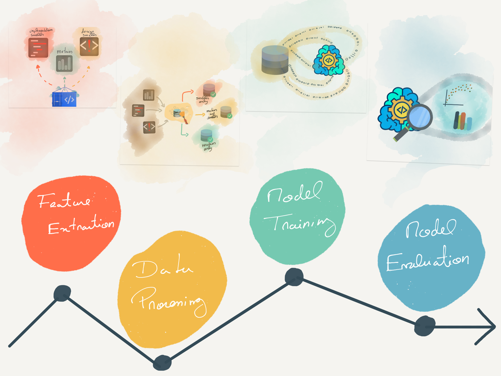

# Extremely Imbalanced Smell Based Defect Prediction

The methodology defining the smell-based defect prediction process is composed by four steps.
1. *Feature Extraction* step. We extract all the required features for the dataset generation. [Feature Extraction source code](feature-extraction)
2. *Data Processing* step. We generate the datasets and prepare them for training. This includes applying standardization, stratification and removing non-defective training instances. [Data Processing source code](dataset-processing)
3. *Model Training* step. We trained the autoencoders. [Model Training source code](model-training/)
4. *Evaluation Approach* step. We evaluate each model using the Receiver Operating Characteristic and the Precision-Recall-Gain curve. [Evaluation Approach source code](evaluation-approach/)

