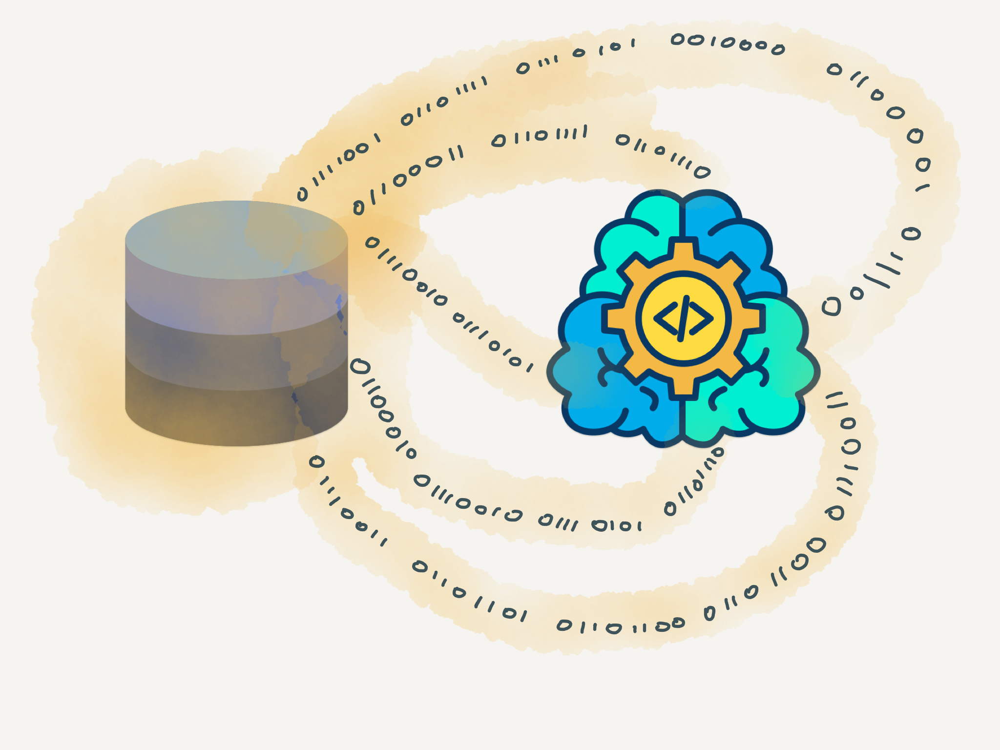

# Model Training

The purpose of this tool is to train five variations of autoencoder architectures with three datasets generated in [Dataset Generation Phase](../dataset-processing). The first dataset is composed by only design and implementation smells. The second dataset is composed by traditional object-oriented metrics. And the last is composed by the combination of all features.

